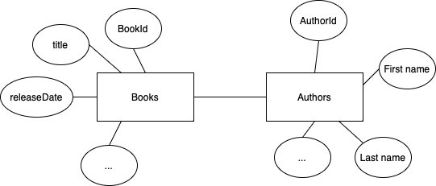

# Cassandra

## Task

Sumodeliuokite nesudėtingą sritį Cassandra duomenų bazėje. Parašykite programą naudojančią duomenų bazę ir leidžiančią atlikti kelias operacijas pasirinktoje srityje.
Su programa pateikite duomenų modelio diagramą.
Savybės sričiai:
1) Egzistuoja bent kelios esybės
2) Yra bent dvi esybės su vienas-su-daug sąryšiu
3) Panaudojimo atvejuose bent vienai esybei reikalingos kelios užklausos pagal skirtingus parametrus
   Pavyzdžiui,  banke saugome klientus, jų sąskaitas (vienas su daug sąryšis) ir kreditines korteles. Sąskaitų norime ieškoti pagal klientą (rasti visas jo sąskaitas) bei pagal sąskaitos numerį, klientų norime ieškoti pagal jų kliento ID arba asmens kodą. Kredito kortelių norime ieškoti pagal jų numerį,  taip pat norime rasti sąskaitą susietą su konkrečia kortele.
   Bent vienoje situacijoje prasmingai panaudokite Cassandra compare-and-set operacijas (hint: IF) INSERT ar UPDATE sakinyje. Pavyzdžiui, norime sukurti naują sąskaitą su kodu tik jei ji neegzistuoja. Norime pervesti pinigus, tik jei likutis pakankamas.
   Užklausose ALLOW FILTERING naudoti negalima!

## Software

* Install [.net core 6.0](https://dotnet.microsoft.com/en-us/download)
* Install [Cassandra dotnet packages](https://docs.datastax.com/en/developer/csharp-driver/3.4/)
* Install [Cassandra on docker](https://hub.docker.com/_/cassandra)

## Build and run

* dotnet build
* dotnet run

## Darbo eiga

Sukurtos dvi esybes - knygos ir autoriai


Konceptinis duomenu modelis:





```bash
Hello CassandraUni!
Connected to cluster: Test Cluster
Data load is done.

Show all books available in database:
BookId - 5 Book name - Haris Poteris ir paslapčių kambarys  Release date - 1998
BookId - 10 Book name - Haris Poteris ir Mirties relikvijos  Release date - 2007
BookId - 16 Book name - Maigret  Release date - 1934
BookId - 13 Book name - Mirtis ant Nilo  Release date - 1937
BookId - 11 Book name - Fantastiniai gyvūnai ir kur juos rasti  Release date - 2001
BookId - 1 Book name - Hamletas  Release date - 1605
BookId - 8 Book name - Haris Poteris ir Fenikso brolija  Release date - 2003
BookId - 2 Book name - Romeo ir Džiuljeta  Release date - 1597
BookId - 4 Book name - Haris Poteris ir išminties akmuo  Release date - 1997
BookId - 15 Book name - Fairy Tale  Release date - 2022
BookId - 7 Book name - Haris Poteris ir Ugnies taurė  Release date - 2000
BookId - 6 Book name - Haris Poteris ir Azkabano kalinys  Release date - 1999
BookId - 9 Book name - Haris Poteris ir Netikras Princas  Release date - 2005
BookId - 14 Book name - Tas  Release date - 1986
BookId - 17 Book name - The blue room  Release date - 1964
BookId - 12 Book name - Žmogžudystė Rytų eksprese  Release date - 1934
BookId - 3 Book name - Karalius Lyras  Release date - 1608

Show books filtered by id:
BookId - 1 Book name - Hamletas  Release date - 1605

Show books filtered by title:
BookId - 14 Book name - Tas  Release date - 1986

Show books written by J.K. Rowling
BookId - 4 Book name - Haris Poteris ir išminties akmuo  Release date - 1997
BookId - 5 Book name - Haris Poteris ir paslapčių kambarys  Release date - 1998
BookId - 6 Book name - Haris Poteris ir Azkabano kalinys  Release date - 1999
BookId - 7 Book name - Haris Poteris ir Ugnies taurė  Release date - 2000
BookId - 8 Book name - Haris Poteris ir Fenikso brolija  Release date - 2003
BookId - 9 Book name - Haris Poteris ir Netikras Princas  Release date - 2005
BookId - 10 Book name - Haris Poteris ir Mirties relikvijos  Release date - 2007
BookId - 11 Book name - Fantastiniai gyvūnai ir kur juos rasti  Release date - 2001

Show all writers:
AuthorId - 5 author name - Georges  author last name - Simenon
AuthorId - 1 author name - William  author last name - Shakespeare
AuthorId - 2 author name - Joanne  author last name - Rowling
AuthorId - 4 author name - Stephen  author last name - King
AuthorId - 3 author name - Agatha  author last name - Christie

Find writer by id:
AuthorId - 3 author name - Agatha  author last name - Christie

Find writer by bookid:
Book title - Karalius Lyras AuthorId - 1 author name - William  author last name - Shakespeare
```
