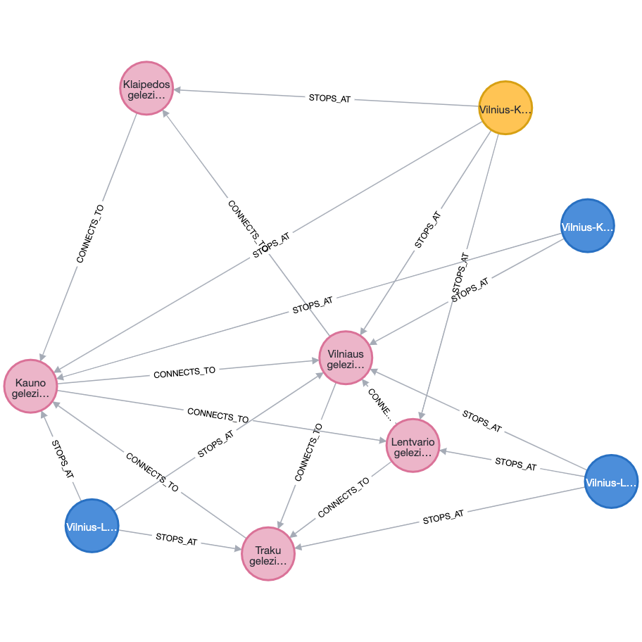

# Neo4j

## Task

Parašyti paprastą programą įgyvendinančią sritį tinkamą grafų duomenų bazėms.
1. Sumodeliuokite bent kelias esybes su savybėmis.
2. Pademonstruokite prasmingas užklausas:
2.1. Surasti esybes pagal savybę (pvz. rasti asmenį pagal asmens kodą, rasti banko sąskaitą pagal numerį).
2.2. Surasti esybes pagal ryšį (pvz. banko sąskaitas priklausančias asmeniui, banko korteles susietas su konkretaus asmens sąskaitomis).
2.3. Surasti esybes susietas giliais sąryšiais (pvz. draugų draugus, visus kelius tarp Vilniaus ir Klaipėdos; visus autobusus kuriais galima nuvažiuoti iš stotelės X į stotelę Y).
2.4. Surasti trumpiausią kelią (pvz. surasti trumpiausią kelią tarp Vilniaus ir Klaipėdos; surasti pigiausią būdą konvertuoti iš valiutos X į valiutą Y, kuomet turima visų bankų konversijos informacija ir optimalus būdas, gali būti atlikti kelis žingsnius).
2.5. Agreguojami duomenys (pvz. kaip 2.4, tik surasti kelio ilgį ar konversijos kainą). Nenaudokite trumpiausio kelio.

Paprastumo dėlei, būkite pasiruošę testinius duomenis. Programa turėtų leisti atlikti užklausas (tarkime įvedamas miestas X, miestas Y ir suplanuojamas kelias tarp jų).

## Software

* Install [.net core 6.0](https://dotnet.microsoft.com/en-us/download)
* Install [Neo4j on dotnet](https://neo4j.com/developer/dotnet/)
* Install [Neo4j on docker](https://neo4j.com/developer/docker-run-neo4j/)

## Build and run

* dotnet build
* dotnet run

### Graph model:


```
Duombaze importuota sekmingai.

Find existing trains by name:
Vilnius-Kaunas-Vilnius, 80, False

Find existing trains that begins with Vilnius-Lentvaris:
Vilnius-Lentvaris-Trakai-Lenvtaris-Vilnius, 60, False
Vilnius-Lentvaris-Kaunas-Lenvtaris-Vilnius, 80, False

Find trains that get from station to station:
Vilnius-Lentvaris-Trakai-Lenvtaris-Vilnius
Vilnius-Klaipeda-Vilnius

Find trains shortest trains to get from and to station:
Vilniaus gelezinkelio stotis - Klaipedos gelezinkelio stotis - Kauno gelezinkelio stotis - 35 pinigeliai
Vilniaus gelezinkelio stotis - Traku gelezinkelio stotis - Kauno gelezinkelio stotis - 9 pinigeliai

Find trains to get from and to station with limited number of hopes:
Stations:Vilniaus gelezinkelio stotis - Traku gelezinkelio stotis - Kauno gelezinkelio stotis - Price per stations: 3 - 6 -  total price - 9 pinigeliai
Stations:Vilniaus gelezinkelio stotis - Klaipedos gelezinkelio stotis - Kauno gelezinkelio stotis - Price per stations: 20 - 15 -  total price - 35 pinigeliai
```

